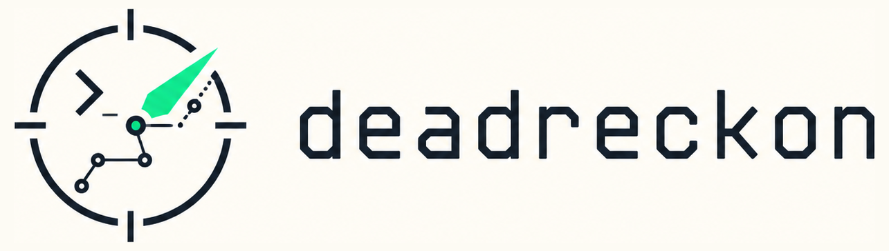

<p align="center">
  
</p>

# deadreckon

**A harness around the agent CLI you already use, so you can actually walk away.**

Claude Code, Codex, Cursor CLI, and the rest are good at writing code. They are not built to run unattended for hours and tell you, honestly, whether the work got done. deadreckon is.

You bring the agent CLI you already trust. You tell deadreckon what "done" looks like in plain English. It runs the work in an isolated sandbox, saves every turn, and uses a separate watchdog process to decide when the run is actually finished: a watchdog the agent cannot fool.

```bash
deadreckon def-done "users can sign up, log in, and save a drawing"
deadreckon run "build the app"
# walk away, attach later from any terminal
deadreckon attach latest
```

> [!TIP]
> deadreckon is alpha software. The core lifecycle (isolated runs, signed gates, durable state, undo, docs, and apply) is implemented and tested, but expect rough edges and breaking changes.

## How it works

1. **You write "done" in plain English.** deadreckon compiles it into executable checks: tests that must pass, files that must exist, scripts that must succeed.
2. **The agent runs in an isolated worktree**, inside a sandbox. Your real checkout is never touched.
3. **Every turn is saved** (state, spend, traces, file provenance, snapshots) so you can attach, kill, resume, undo, or audit any moment.
4. **A separate watchdog process (`dr-gate`) decides when the work is done.** It holds a secret the agent process cannot read, and signs the result with that secret. The agent cannot forge the signature, so it cannot mark its own work as accepted.
5. **If the checks fail, the loop keeps going.** The agent gets another turn. When the watchdog finally signs off for real, the run is atomically promoted to a reviewable artifact: narrative, decisions, file provenance, full audit trail.

The loop is the product. The agent CLI does the coding. deadreckon decides when "done" actually means done.

## Why this matters

- **You can leave a long run going and trust the result.** The agent can't lie its way out of the gate.
- **Use whichever agent CLI you prefer.** Claude Code, Codex, Cursor CLI, or direct Anthropic / OpenAI API: deadreckon supervises any of them.
- **You get an auditable artifact, not a chat transcript.** Narrative, decisions, file lineage, spend, traces, all on disk.
- **If anything dies (terminal, network, the model) the run survives.** Attach from a new terminal, resume from any turn, undo a bad step.

## Why "deadreckon"?

Dead reckoning is navigation without perfect visibility: track every move so you know where you are now. Unattended agents are the same problem: long task, partial context, the terminal may be gone when you look back. The name is the contract: don't trust the final answer, navigate by evidence.

The questions deadreckon is built to answer:

- Where did the agent run, and what did it spend?
- Can I attach after closing my laptop?
- Can I undo turn 7 without rolling back the whole project?
- Can I prove the agent did not mark its own work as accepted?

## Features

### Your Checkout Is Never Touched (Isolated Worktrees By Default)

In a git repo, `deadreckon run` creates a separate `git worktree` on a `dr/...` branch under `~/.deadreckon/worktrees/`. Your checkout is left untouched until you explicitly run:

```bash
deadreckon apply <run-id>
```

Run ids accept unique prefixes, and most commands also accept `latest` for the
newest run in the current project.

You can also run in copy mode, fresh mode, or explicit in-place mode:

```bash
deadreckon run "goal" --from .
deadreckon run "goal" --fresh
deadreckon run "goal" --in-place --i-know-its-a-lot
```

### Use The Agent CLI You Already Trust

Route turns through whichever provider you prefer:

- **Local CLIs** (subscription): `cli:claude-code`, `cli:codex`
- **Direct APIs** (BYOK): `anthropic`, `openai`, OpenAI-compatible endpoints
- **Smoke** (keyless): `--smoke` for local verification

The CLI does the coding; deadreckon owns the run boundary around it.

### Crash-Proof: Every Turn Is Saved To Disk

Every turn writes state, traces, spend, file provenance, and a working-directory snapshot under `~/.deadreckon/runstate/`. If the terminal dies, attach from another. If the run itself crashes, resume from the last completed turn.

### Walk Away, Attach From Any Terminal

```bash
deadreckon attach latest
```

The TUI shows live status, current step, spend, recent file edits, and provider activity. Completed runs render `RUN-NARRATIVE.md` inline. Press `Ctrl-D` to detach without killing the run.

### Set A Budget And A Time Limit, Then Walk Away

Every provider response appends a spend record and updates totals. API routes track token cost. Subscription CLI routes can be capped by wall-clock time.

```bash
deadreckon run "large refactor" --max-spend 15
deadreckon run "large refactor" --max-wall-seconds 1800
```

High spend requires explicit confirmation, so scripts do not accidentally launch expensive runs.

### Undo A Single Bad Turn Without Losing The Rest

deadreckon snapshots the working directory at turn boundaries:

```bash
deadreckon undo --run <run-id>
deadreckon undo --run <run-id> --turn 3
```

This is not just `git reset`. It works against the run's own snapshot trail and records the undo in the run trace.

### Write "Done" In English, Verified By A Watchdog

Tell deadreckon what success looks like in plain language. It compiles your sentence into executable checks that an independent watchdog runs:

```bash
deadreckon def-done "build, load in a browser, and show no console errors"
deadreckon def-done add "users can save drawings"
deadreckon def-done check
deadreckon run "finish the app"
```

`deadreckon run` and `deadreckon chain run` prompt interactively when a project has no acceptance file yet. Generated files live under `.deadreckon/`.

**Why the watchdog matters.** The watchdog holds a secret the agent process cannot read. It stamps the result with that secret. Without a valid stamp, the run can't terminate, and the agent can't produce the stamp itself.

If no acceptance file is configured, the default is "the working directory exists and `cargo test` passes" (when `Cargo.toml` is present).

You can still edit the compiled YAML directly:

```yaml
name: notes check
checks:
  - kind: file_exists
    path: "{working_dir}/notes.md"
  - kind: content_match
    path: "{working_dir}/notes.md"
    pattern: "dead reckoning"
  - kind: build_success
    cwd: "{working_dir}"
```

Supported executable check kinds are `cargo_test`, `file_exists`, `content_match`, `build_success`, and `shell`. `content_match` treats `pattern` as a regex when valid, with substring fallback for simple text.

### Get An Auditable Artifact, Not A Transcript

deadreckon records which model/tool call touched which files, then writes self-documenting artifacts for the completed run:

```bash
deadreckon doc <run-id>
deadreckon doc <run-id> --kind as-built
deadreckon doc <run-id> --kind decisions
deadreckon doc <run-id> --kind delta
```

Each accepted run produces a review packet:

- `RUN-NARRATIVE.md` explains what happened.
- `RUN-AS-BUILT.md` captures the subsystem shape after the run.
- `RUN-DECISIONS.md` records meaningful decisions.
- `AS-BUILT-DELTA.md` proposes architecture-doc updates when the run is broad enough.
- `manifest.json` records what was built and from what.

Agentic CLIs usually leave you with a patch and a transcript. deadreckon turns
the session into a local published artifact you can inspect, materialize, extend,
or apply.

### Resume, Kill, Extend, Or Export Any Run

Runs are lifecycle objects, not one terminal session:

```bash
deadreckon list
deadreckon status
deadreckon show latest
deadreckon kill latest
deadreckon resume latest
deadreckon resume latest --from-turn 2
deadreckon extend latest "add tests and polish the UI"
deadreckon finish latest
deadreckon export latest --dest ./finished-project
deadreckon cleanup --completed
```

Resume reconstructs history from durable traces and ignores incomplete trailing trace entries.

### Autonomous Chains For Multi-Step Work

Some tasks are too big for one goal. Chains let you break work into ordered steps that run end-to-end, with the same gate enforcement and the same lifecycle commands per step:

```bash
deadreckon chain plan "ship a working SaaS billing flow" --n 4
deadreckon chain run latest
deadreckon chain attach latest
deadreckon chain kill latest
```

Each chain step is a real run with its own signed acceptance gate. If a step fails its gate, the chain stops there; later steps don't start. Killing a chain cascades to whatever step is live. The attach TUI shows the whole chain timeline, not just the current turn, so you can see where you are in the plan without leaving the dashboard.

You can also extend a finished run into a follow-up step instead of planning the whole chain up front:

```bash
deadreckon chain extend latest "add billing webhooks and retry logic"
```

## The Mental Model

```text
your repo
  |
  | deadreckon def-done "what 'finished' looks like, in English"
  | deadreckon run  "what to build"
  v
isolated worktree or copy   ◄── your real checkout untouched
  |
  | provider route: cli:codex, cli:claude-code, anthropic, openai, ...
  v
sandboxed turn loop         ◄── agent works here
  |
  | every turn: trace, spend, provenance, snapshot, docs
  | check fails? agent gets another turn
  v
dr-gate watchdog            ◄── separate process, holds hidden nonce
  |                              agent CANNOT produce a valid marker
  | checks pass + signature valid?
  v
promoted artifact           ◄── narrative, decisions, file lineage
  |
  | inspect, doc, apply, discard, extend, export, cleanup
  v
your branch or library
```

For multi-step work, `deadreckon chain` wraps this whole loop and runs N of them in order, stopping on the first gate failure.

The agent owns the coding. deadreckon owns the boundary.

## Quickstart

Build once:

```bash
cargo build --release
```

The binary is `./target/release/deadreckon`. Add it to your `PATH` or alias it; the rest of this README just says `deadreckon`.

Install shell tab completion. `deadreckon init` does this automatically when it
can detect your shell; this command repairs or installs it later:

```bash
deadreckon completion install
```

For raw generated scripts or shell overrides, run `deadreckon completion --help`.

Configure and run a task end-to-end:

```bash
deadreckon init --provider cli:claude-code --sandbox auto --max-spend 10

deadreckon def-done   "users can sign up, log in, and save a drawing"
deadreckon run    "build the app"
deadreckon attach latest    # watch live, Ctrl-D to detach
deadreckon doc    latest    # read the narrative once done
deadreckon apply  latest --autostash --cleanup
```

`run` prints the run id and attach command immediately, and shows a preview of mode, branch, base ref, and worktree path before creating anything. Use `--preview` to print the preview and exit.

### Try It Without API Keys

```bash
DEADRECKON_HOME=$PWD/.deadreckon-smoke \
  deadreckon run "tiny hello rust" --smoke --sandbox none --max-spend 1
```

The provider response is faked, but every other moving part (turn loop, sandbox, snapshots, spend, traces, gate) is real.

## Configuration

Switch providers, models, or defaults:

```bash
deadreckon init --provider cli:codex --sandbox auto --max-spend 10
deadreckon init --provider anthropic --api-key "$ANTHROPIC_API_KEY"
deadreckon config provider cli:claude-code
deadreckon config model sonnet --provider cli:claude-code
deadreckon config set defaults.max_spend 15
```

Override per run:

```bash
deadreckon run "goal" --provider cli:codex --model gpt-5.1-codex
deadreckon run --preview "goal"     # show route and model, don't start
```

Runtime config lives at `~/.deadreckon/config.toml`. Set `DEADRECKON_HOME` for isolated local runs or tests.

### Sandbox Backends

| Backend | What it is |
|---|---|
| `auto` | Picks the right native sandbox for your OS (default) |
| `sandbox-exec` | macOS native |
| `bwrap` | Linux native (bubblewrap) |
| `docker` | Opt-in container sandbox |
| `none` | Off (unsafe for real unattended work) |

Check what your machine supports with `deadreckon doctor`.

## Compared With Agentic Coding CLIs

deadreckon doesn't replace Claude Code, Codex, or Cursor CLI; it supervises them. Use deadreckon when the task is too long, risky, or expensive to "run the agent in my checkout and hope I can reconstruct what happened."

| Operational concern | Agentic CLI alone | deadreckon supervising the CLI |
|---|---|---|
| Workspace safety | Often runs where you start it | Creates an isolated worktree by default and leaves your checkout untouched |
| Long-running attach | Usually tied to the current terminal session | Run state is durable; attach from another terminal later |
| Process control | Kill/resume behavior varies by tool | Tracks child PIDs, kills live work, resumes from durable state |
| Spend control | Token/cost visibility varies by provider | Writes `spend.jsonl`, tracks totals, enforces spend and wall-clock caps |
| Undo | Usually git-level or manual | Snapshots every turn and restores a specific turn with `deadreckon undo` |
| Provenance | Conversation history may not map cleanly to file changes | Records model/tool/file linkage in `provenance.jsonl` |
| Observability | Tool logs are tool-specific | Writes normalized `events.jsonl`, `traces.jsonl`, spend, docs, and run state |
| Done criteria | The agent may declare itself done | Requires a signed `dr-gate` marker before promotion |
| Applying work | Patch review/apply flow is tool-specific | `apply`, `discard`, `export`, `extend`, and `cleanup` are first-class lifecycle actions |
| Multi-run coordination | Usually left to the operator | Scope/task locks prevent conflicting same-task runs |

Use the agentic CLI for intelligence. Use deadreckon for isolation, supervision, evidence, recovery, and promotion.

## Command Surface

Core lifecycle:

```text
init          create local config
config        inspect or edit config keys
run           start an unattended coding run
attach        open the live dashboard
status        latest run and next action for this project
list          list runs (current project; --all for every scope)
show          inspect state, lineage, spend, files
doc           print or export run documentation
apply         apply a completed worktree run to your branch
abandon       remove a worktree run and temporary branch
materialize   copy a completed artifact to a normal directory
extend        continue from a completed run
resume        continue an interrupted run
kill          stop a live run and child processes
undo          restore a previous turn snapshot
cleanup       clean abandoned, stale, or completed worktrees
finish        choose apply or export from completed run
import        normalize histories from other coding tools
doctor        check config, providers, sandboxes, disk, runtime
```

Aliases: `keep` → `apply`, `discard` → `abandon`, `export` → `materialize`, `prune` → `cleanup`, `follow-up` → `extend`, `continue` → `resume`, `stop` → `kill`, `next` → `status`.

## Verification

Full local verification:

```bash
make verify
```

Useful targeted checks:

```bash
make build
make smoke
make doctor
STRESS_SECONDS=30 make stress
```

The workspace test suite covers provider routing, mock OpenAI-compatible runs, CLI-provider wrappers, kill/resume behavior, signed gates, snapshots, provenance/trace linkage, worktree/copy/in-place modes, lifecycle actions, docs generation, and multi-run locking.

## Status

deadreckon is alpha software. The core lifecycle (isolated runs, signed gates, durable state, undo, docs, and apply) is implemented and tested.

The V1 candidate list is deliberately short. The next big feature is explicit sub-agent forking:

```text
deadreckon fork <run-id> --prompt "..."
```

## Documentation

- [HOWTO.md](HOWTO.md): practical usage guide
- [docs/DEVELOPMENT-README.md](docs/DEVELOPMENT-README.md): preserved developer-oriented README notes
- [DESIGN.md](DESIGN.md): product and architecture intent
- [docs/AS-BUILT-ARCHITECTURE.md](docs/AS-BUILT-ARCHITECTURE.md): detailed implementation reference
- [docs/RESUME-SEMANTICS.md](docs/RESUME-SEMANTICS.md): crash and resume semantics
- [docs/MULTI-RUN.md](docs/MULTI-RUN.md): lock ordering and concurrency rules
- [docs/GAP-ANALYSIS.md](docs/GAP-ANALYSIS.md): primary-flow audit
- [docs/V1-CANDIDATES.md](docs/V1-CANDIDATES.md): deferred features
